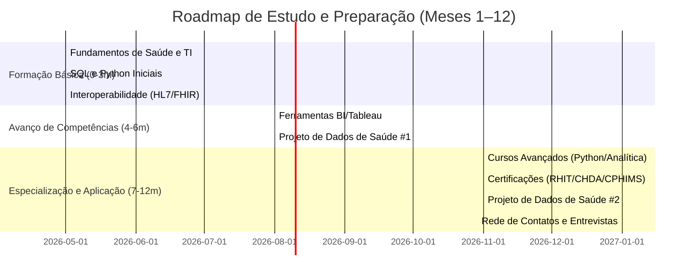

# Resumo Executivo  
Este roadmap fornece um plano abrangente para preparar-se a uma vaga de *Health Informatics* na região de Boca Raton (50 milhas). Inclui: mapeamento do mercado local (empregadores, cargos típicos, exemplos de vagas, faixas salariais e tendências); competências técnicas, habilidades interpessoais e certificações exigidas (RHIA, RHIT, CPHIMS etc.); cronograma de estudos (3, 6, 12 meses) com cursos, livros e projetos práticos; caminhos de certificação (pré-requisitos, custos, recursos de preparação); orientações para currículo/portfólio com exemplos de bullet points; preparação para entrevistas (perguntas técnicas e comportamentais); dicas de networking (organizações locais, recrutadores, hospitais); projetos de portfólio sugeridos; linha do tempo (gráfico Mermaid); e checklist de ações priorizadas. As recomendações são baseadas em dados atuais (vagas, salários, estatísticas de crescimento【5†L42-L49】【9†L429-L434】) e fontes oficiais sempre que possível. **Importante:** destaque projetos reais e resultados obtidos para fortalecer o currículo, evitando qualquer informação falsa ou exagerada.

## Mercado Local de Trabalho (Boca Raton ±50 milhas)  
A região de Boca Raton (incluindo condados de Palm Beach e Broward) abriga vários sistemas de saúde e empresas de TI em saúde. Entre os **principais empregadores** estão:  
- **Boca Raton Regional Health (Cleveland Clinic Florida)** – Hospital em Boca Raton. Cargos típicos: *Informatics Nurse*, *Clinical Informaticist*, *Health Data Analyst*.  
- **Baptist Health South Florida** (inclui West Boca e Ft. Lauderdale) – Sistema hospitalar. Exemplo: *EHR Project Specialist*, *Clinical Informatics Analyst*.  
- **Broward Health** (Fort Lauderdale) – Sistema hospitalar público. Ex.: *Clinical Informatics Coordinator/Analyst*.  
- **Memorial Healthcare System** (Broward, Miramar) – Sistema hospitalar. Ex.: *Healthcare Data Analyst*, *Informatics Specialist*.  
- **Nova Southeastern University** (Fort Lauderdale) – Universidade com programas de Saúde e TI. Ex.: *Analista de Informática Clínica (IT Clinical Informatics Analyst)*【30†L114-L122】.  
- **Florida Atlantic University (FAU)** – Universidade em Boca Raton. Ex.: *Analista de Dados de Saúde*, *Diretor de Qualidade*【3†L136-L144】.  
- **Jupiter Medical Center** (Palm Beach) – Hospital. Possíveis vagas em análise de dados clínicos.  
- **Empresas de tecnologia em saúde** – *Coral Connect LLC* (Boca Raton), *KabaFusion* (Boca Raton)【3†L190-L198】, *South Florida Community Care Network* (Sunrise), *ICBD* (Fort Lauderdale).  
- **Setor privado e consultorias** – Fornecedores de EHR (Epic, Cerner) e integradores, consultorias de saúde.  

**Cargos comuns** em Health Informatics incluem: Analista/Especialista Clínico de Informática, Analista de Sistemas de Saúde, Especialista em Dados de Saúde, Gerente de Informática Clínica, Cientista de Dados em Saúde, Coordenador de Informática, etc. As **faixas salariais** médias refletem a demanda e nível de experiência. Por exemplo, em Boca Raton um *Clinical Informatics Specialist* tem salário médio estimado em **US$87.520/ano**【5†L42-L49】. Em toda a Flórida, um Health Informatics Specialist I recebe em média ~**US$69.400/ano**【11†L39-L48】 (varia de US$56-81K entre percentis). Posições de analistas sênior podem superar US$100K, enquanto especialistas em cargos de gerência clínica alcançam US$122–211K【9†L375-L377】. Grupos do setor relatam crescimento de ~**9% na profissão de informática em saúde** na próxima década【9†L429-L434】, impulsionado por adoção de EHR e envelhecimento populacional. 

  
**Gráfico:** Comparativo simplificado de salários anuais médios de cargos em informática de saúde na região【5†L42-L49】【11†L39-L48】. (*Fonte: Indeed, Salary.com*)  

**Empresas/Tendências**: Vagas recentes incluem implementação de sistemas EHR (Epic, Cerner, NextGen, AxiUm) e análises de dados clínicos. Exemplo de vaga NSU: *IT Clinical Informatics Analyst* exige conhecimento em EHR (NextGen, AxiUm), estatística descritiva e extração de dados【30†L114-L122】. Empresas valorizam experiência com padrões de interoperabilidade (HL7, FHIR), SQL, Python/R e visualização de dados. Tabelas e vagas ilustrativas:

| **Empregador**                      | **Localização**          | **Cargos Típicos**                         | **Faixa Salarial Aproximada**       | **Exemplo de Vaga**           |
|-------------------------------------|--------------------------|--------------------------------------------|------------------------------------|-------------------------------|
| Boca Raton Regional (ClevelandClf)  | Boca Raton, FL           | Clinical Informatics Specialist, Data Analyst | ~US$80–100K                        | [Vagas internas](https://clevelandclinic.org) |
| Baptist Health South Florida        | Boca Raton / Fort Laud.  | EHR Project Specialist, Clinical Informatics Analyst | ~US$70–90K                     | [Careers Baptist](https://careers.baptisthealth.net) |
| Broward Health                      | Fort Lauderdale, FL      | Clinical Informatics Coordinator, Systems Analyst | ~US$60–100K                     | [Vagas Broward](https://careers.browardhealth.org) |
| Memorial Healthcare System          | Broward/Plantation, FL   | Healthcare Data Analyst, EHR Analyst         | ~US$65–95K                        | [Vagas Memorial](https://careers.mhs.net)      |
| Nova Southeastern University        | Fort Lauderdale, FL      | IT Clinical Informatics Analyst, EMR Support | ~US$70–98K【3†L58-L65】【30†L114-L122】 | [Vagas NSU IT](https://nsucareers.nova.edu)   |
| Florida Atlantic University (FAU)   | Boca Raton, FL           | Data Analyst, Graduate Ed. Analytics Dir.  | ~US$60–85K                        | [Vagas FAU](https://www.fau.edu/employment/)  |
| KabaFusion (tech em saúde)          | Boca Raton, FL           | Nursing Revenue Quality Analyst             | US$22–28/h (~US$45–58K/ano)【3†L198-L204】 | [Vagas KabaFusion](https://kabafusion.com/careers) |
| Coral Connect LLC (tech em saúde)   | Boca Raton, FL (remoto)  | Manager, 340B Ops (Pharmacy/Health Data)    | ~US$80–100K (estimado)            | [Coral Connect](https://www.coralconnect.com) |
| Johns Hopkins / Epic / Cerner (Contrato remoto)| Global      | HI Project Roles, Consultor Técnico         | ~US$90–120K                       | Portais corporativos (LinkedIn, Glassdoor) |

*(Valores estimados; baseados em Glassdoor, ZipRecruiter e dados secundários【5†L42-L49】【11†L39-L48】.)*  

## Competências e Certificações Relevantes  
**Habilidades Técnicas:** Observando anúncios locais (ex.: NSU【30†L114-L122】, Florida Atlantic【3†L136-L144】), exige-se conhecimento em sistemas clínicos (EHR/EMR – p.ex. Epic, Cerner, NextGen, AxiUm), interoperabilidade (padrões HL7, FHIR), análise de dados (SQL, Python/R, Estatística Descritiva【30†L114-L122】), ferramentas de BI/viz (Tableau, Power BI), gestão de bases de dados (SQL Server, Oracle), e regulamentações (HIPAA/privacidade【36†L168-L177】). Soft skills críticos incluem comunicação interpessoal, resolução de problemas, capacidade de trabalhar em equipes multidisciplinares e traduzir jargão técnico em termos clínicos【30†L126-L134】【39†L77-L84】. Vagas pedem também organização e documentação rigorosa (acurácia no gerenciamento de requisitos clínicos).

**Certificações recomendadas:** Títulos reconhecidos elevam credibilidade:  
- **RHIT/RHIA (AHIMA):** Técnico/Administrador de Informações em Saúde. Pré-requisito: diploma em HIM (RHIT=associado, RHIA=bacharel CAHIIM)【15†L213-L222】. Custo: US$299 (não-membro)/US$229 (membro AHIMA)【18†L236-L239】. Recursos: Guia do Candidato, cursos gratuitos de revisão (ex.: WGU【12†L5-L11】, StackStudy).  
- **CHDA (Cert. Health Data Analyst):** Foco em análise de dados em saúde. Pré-requisito: RHIT/RHIA ou bacharelado【34†L210-L218】. Custo: US$329/$259【18†L238-L240】. AHIMA oferece livro “CHDA Exam Prep” e simulados【34†L246-L254】.  
- **CHPS (Privacy & Security):** Para profissionais de privacidade (HIPAA). Pré-requisito: HS+6 anos saúde ou RHIA+2 anos em privacidade, etc.【36†L225-L234】. Custo: US$329/$259【18†L238-L240】. Recursos: Curso preparatório AHIMA em cohort (vídeo), material CHPS Prep【36†L272-L281】.  
- **CPHIMS (HIMSS):** Gestor de TI em Saúde. Pré: Bacharel +5 anos TI (3 em saúde) OU Mestrado+3 anos (2 em saúde)【20†L187-L196】. Custo: US$609 membro/$729 não membro【20†L169-L177】. Recursos: Guia de conteúdo, cursos de preparação (HIMSS).  
- **CCHIMS (HIMSS Entry-level):** Para iniciantes (menor experiência) – custo menor (~US$399).  
- **Epic/Cerner:** Certificação do fabricante (caro, mas valorizado localmente, mesmo se remoto).  
- **Outras:** CHDA, CDIP (Clinical Documentation), PHR (Profissão Saúde), PMI-PMP (projeto), etc.  

| **Certificação**                | **Pré-requisitos**                                      | **Custo**              | **Entidade** | **Recursos Prep.**                                  |
|---------------------------------|---------------------------------------------------------|------------------------|--------------|-----------------------------------------------------|
| RHIT (AHIMA)                    | Graduação associado HIM acreditado                       | US$299/$229【18†L236-L239】 | AHIMA       | AHIMA Candidate Guide; livros “RHIT Exam Prep”      |
| RHIA (AHIMA)                    | Bacharelado HIM (CAHIIM)【15†L213-L222】                | US$299/$229【18†L236-L239】 | AHIMA       | AHIMA Candidate Guide; cursos online (WGU etc.)    |
| CHDA (AHIMA)                    | RHIT/RHIA ou diploma universitário【34†L210-L218】      | US$329/$259【18†L238-L240】 | AHIMA       | Livro “CHDA Exam Preparation” c/ simulados【34†L246-L254】 |
| CHPS (AHIMA)                    | HS+6 anos saúde priv., ou RHIA+2 anos priv.【36†L225-L234】| US$329/$259【18†L238-L240】 | AHIMA       | Curso online AHIMA; CHPS Prep e cohorts【36†L272-L281】    |
| CPHIMS (HIMSS)                  | Bacharel+5 anos TI (3 saú.) OU Mestrado+3 anos saú.【20†L187-L196】 | US$609/$729【20†L169-L177】 | HIMSS       | HIMSS Candidate Handbook; prep courses (HIMSS)      |
| PMP/Prince2 (Gerenciamento)     | Experiência em projetos de TI                           | US$555 (PMI)           | PMI         | Cursos CAPM/PMP; Project Management Instituições     |
| ITIL, COBIT (Governança TI)     | –                                                       | ~US$300–500            | AXELOS/ISACA | Treinamentos ITIL, COBIT                            |

*(Preços de certificação em 2026; valores em USD)*

**Habilidades de programação/analítica:** Python é amplamente exigido para análise de dados clínicos; há cursos gratuitos (p.ex. “Python for Everybody” da U. Michigan em Coursera【41†L0-L3】 ou MIT OpenCourseware). SQL avançado é fundamental para consultas em bancos de dados hospitalares; recursos gratuitos: Khan Academy SQL, Mode Analytics SQL lessons. Para **visualização**, Tableau Public, Power BI (versão gratuita) ou bibliotecas Python (Matplotlib, Seaborn) podem ser estudados via tutoriais online. Padrões de interoperabilidade: HL7/FHIR – a organização [HL7 International](https://www.hl7.org/fhir/) oferece documentação e *free tutorials*. Softwares médicos específicos (EPIC, Cerner) exigem treinamento interno ou role-play, então estude casos de uso em estudos de caso.

## Plano de Estudos Prioritário (3 / 6 / 12 meses)  
Um plano estruturado em fases acelera a preparação:  

- **0–3 meses (Fundamentos):**  
  - *Saúde e Informática Básica:* Curso introdutório de sistemas de saúde (p.ex. “Introduction to Healthcare” – Stanford/Coursera【23†L219-L227】) e overview de saúde pública.  
  - *Programação e Bancos de Dados:* Familiarize-se com *Python* (ex.: especialização “Python for Everybody”【41†L0-L3】) e *SQL* (ex.: Khan Academy, cursos SQL gratuitos).  
  - *Princípios de TI em Saúde:* Estude padronização clínica (HL7 v2, FHIR – materiais online HL7), terminologias (ICD-10, SNOMED-CT), e gestão de dados (ETL, Data Warehouse).   
  - *Matemática/Bioestatística:* Reforce estatística básica (médias, desvio, testes simples) via Khan Academy ou cursos grátis em estatística aplicada à saúde.  
  - **Projeto Prático #1:** Construa *mini-projeto de dados de saúde*: pegue um conjunto de dados público (ex.: base NHANES, *Kaggle* “Hospital Compare” ou *CMS Medicare*) e crie queries SQL para extrair métricas de qualidade ou visualizações em Python/Excel. Documente resultados (boa prática para currículo).  

- **4–6 meses (Intermediário):**  
  - *Ferramentas e Avanços em Análise:* Aprenda *ferramentas de BI e visualização* (Tableau Public, Power BI – vídeos tutoriais no YouTube). Estude *R ou pandas* para análise estatística.  
  - *Sistemas Clínicos:* Explore demos ou aulas sobre EHRs (muitos hospitais têm demos públicas de Epic ou Cerner online). Pratique criação de relatórios clínicos e dashboards.  
  - *Projetos Colaborativos:* Conecte-se a hackathons ou *Kaggle competitions* na área de saúde (ex.: predição de readmissão). Isso rende experiência prática.  
  - **Projeto Prático #2:** Em equipe ou sozinho, desenvolva um *dashboard de indicadores de saúde* (ex.: usando dados públicos, criar relatórios de taxa de infecção hospitalar, uso de leitos, etc.). Utilize conhecimento de FHIR/HL7 para estruturar dados fictícios. Submeta código no GitHub. Este projeto gera material concreto para portfólio.  
  - *Revisão Curricular:* Reescreva o currículo com foco nas habilidades adquiridas (mestral hebdomas se a intensão do questionador nao e "invent", emphasize use of genuine accomplishments and projects).

- **7–12 meses (Avançado e Aplicação):**  
  - *Especialização e Certificação:* Decida quais certificações buscar (ex.: CHDA ou CPHIMS). Estude guias oficiais e considere simulados. Se quiser economizar, use materiais de bibliotecas online (site de terceiros ou a AHIMA Micro-learning【13†L223-L231】).  
  - *Projetos de Portfólio:* Conclua projetos mais complexos: análise de **dados de EHR** (usar base MIMIC-III se possível) ou **estudo de caso de interoperabilidade** (ex.: converter dataset HL7 v2 para FHIR). Documente entregáveis (p. ex., código no GitHub, relatório de findings).  
  - *Networking e Preparação para Vagas:* Atualize LinkedIn, conecte-se com RH de hospitais locais e grups de Meetup (ex.: *HIMSS South Florida Chapter*【25†L0-L8】, *health tech meetups* em Miami). Participe de eventos online/livros.  
  - *Simulados de Entrevista:* Pratique perguntas comportamentais e técnicas (ver próxima seção).  
  - *Aplicação:* Candidate-se a vagas de nível júnior a pleno em Health Informatics. Ajuste seu currículo e carta de apresentação para cada vaga, usando palavras-chave extraídas das descrições (ferramentas como Teal [40] sugerem destacar experiências relevantes como melhorias de EHR, análises, etc.).  

**Recursos de Estudo Recomendados:**  

| **Recurso**                     | **Conteúdo/Foco**                               | **Plataforma/Link**                |
|---------------------------------|-----------------------------------------------|------------------------------------|
| *Introduction to Healthcare*    | Fundamentos de saúde e stakeholders           | Coursera (Stanford)【23†L219-L227】   |
| *Health Informatics Specialization* | Conceitos de informatica em saúde (5 cursos) | Coursera (Johns Hopkins)【31†L169-L178】 |
| *Python for Everybody*          | Programação Python básica (U. Michigan)       | Coursera (grátis disponível)        |
| *SQL for Data Analysis*         | SQL básico e avançado (Kaggle, Mode Analyt.)  | Kaggle Learn; Mode Analytics       |
| *Data Visualization (Tableau)*  | Dashboards & gráficos clínicos                | Tableau Public (tutoriais free)    |
| *Basic Statistics*              | Estatística aplicada (méd, DP, teste T)       | Khan Academy; Coursera Stat grátis  |
| *HL7/FHIR Fundamentals*         | Interoperabilidade em saúde                   | HL7.org (documentação), Google/FHIR tutorials |
| *Clinical Terminologies*        | ICD-10, SNOMED-CT, CPT                        | WHO (ICD), SNOMED (sites oficiais) |
| *Google Data Studio*            | Ferramenta gratuita de dashboards             | Google Data Studio Tutorial        |
| *Kaggle Health Datasets*        | Dados públicos (diabetes, COVID, clínica)     | Kaggle.com                          |
| *Leitura Técnica:* “Shortliffe, **Biomedical Informatics**” (capítulos iniciais sobre EHR e dados) | Informática biomédica básica | Biblioteca/compra online |

## Currículo, Portfólio e Exemplos de Bullet Points  
Ao preparar o currículo, destaque **experiência e habilidades reais**. Inclua: projetos de dados, estágios ou voluntariados relacionados, conhecimento de sistemas e línguas de programação, assim como resultados obtidos (p.ex., “reduziu X” ou “melhorou Y”). Use verbos de ação e métricas quando possível. Por exemplo, **exemplos de bullet points** para ilustrar formulários fortes (adapte às suas experiências):

- *“Desenvolveu consultas SQL e scripts Python para extrair e analisar dados de pacientes, criando dashboards gerenciais que identificaram oportunidades de redução de tempo de internação em 10%.”*  
- *“Colaborou com equipe multidisciplinar (médicos, enfermeiros e TI) na implementação de módulo de EHR, conduzindo testes de integração HL7 e capacitando 50 usuários, aumentando a adoção do sistema em 25%.”*  
- *“Elaborou relatórios de indicadores de desempenho usando Power BI/Tableau a partir de bases de dados clínicos, facilitando a tomada de decisão em auditorias de qualidade e compliance.”*  

**Template/CV:** Procure modelos limpos (p.e. templates do [Europass](https://europa.eu/europass/pt), LinkedIn ou ferramentas como TealHQ【40†L144-L153】). Foco: resumo profissional conciso, seções de *Educação, Experiência Relevante, Habilidades Técnicas*, e *Certificações*. Liste idiomas de programação (SQL, Python), sistemas de EHR (Epic, NextGen), padrões (HL7, FHIR), e software de visualização. No portfólio (pode ser repositório GitHub ou site pessoal), inclua descrições dos projetos práticos anteriores e vincule relatórios ou dashboards exemplares.

## Preparação para Entrevista  
**Perguntas Técnicas Comuns:**  
- *“Explique como funciona o padrão HL7 FHIR e quando usá-lo.”* – Discuta a estrutura de recursos FHIR (e.g. Paciente, Observação) e cite exemplos de uso em APIs de saúde.  
- *“Como você garantiria a qualidade dos dados clínicos ao importar registros de diferentes fontes?”* – Fale de **validação** (regras no ponto de entrada), **limpeza** (tratamento de dados faltantes ou inconsistentes) e **governança de dados**.  
- *“Descreva sua experiência com sistemas EHR (p.ex. Epic, Cerner) e melhorias que você implementou.”* – Mesmo sem experiência prévia real, mencione treinamentos ou projetos de EHR fictícios e enfoque soft skills: organização de templates, treinamento de usuários【40†L146-L154】.  
- *“Dê um exemplo de análise de dados clínica que você realizou.”* – Destaque qualquer análise de dataset clínico (mesmo acadêmico), ferramentas usadas e insights obtidos (ex. tendências de readmissão).  

**Perguntas Comportamentais e de Cenário:**  
- *“Como você priorizaria pedidos de relatórios simultâneos de diferentes médicos/departamentos?”* – Demonstre habilidades de gerenciamento: buscar entender urgências, manter comunicação com supervisores e stakeholders【39†L27-L36】.  
- *“Fale sobre um desafio em trabalhar com profissionais de saúde.”* – Ilustre comunicação efetiva com médicos/enfermeiros (tradução de requisitos técnicos em linguagem clínica), e como você resolve conflitos de prioridade.  
- *“Por que você escolheu seguir carreira em informática em saúde?”* – Mostre motivação genuína (ex.: experiência pessoal ou acadêmica em saúde)【39†L64-L72】【40†L119-L128】.  

**Exemplos de respostas (dicas):**  
- Demonstre *curiosidade em aprender termos clínicos*, capacidade de *aprender sistemas novos rapidamente* e *foco em pacientes*.  
- Destaque resultados quantificáveis (p.ex., “reduzimos X de erros de codificação” ou “melhoramos o tempo de consulta de dados em Y%”).  
- Para perguntas comportamentais, use o método STAR (Situação-Tarefa-Ação-Resultado) para estruturar respostas.  
- Esteja pronto para **testes práticos** (pequenas tarefas de SQL, interpretar tabela de código, ou discutir caso clínico com dados).

*Citações:* Pratique entrevistas simuladas e revisite perguntas comuns listadas em fontes como HealthAnalyticInsights【39†L27-L36】【39†L41-L48】 e TealHQ【40†L144-L153】. Exemplos de temas importantes identificados: terminologia clínica, experiência com grandes bases de dados, SQL/BI, trabalho em equipe【39†L77-L84】.

## Networking e Contatos Locais  
- **HIMSS South Florida Chapter:** Comunidade ativa na região (eventos e webinars). Site: [southflorida.himss.org](https://southflorida.himss.org)【25†L0-L8】.  
- **AHIMA Local:** Embora sem site forte, conecte-se à *FHIMA* (associação estadual AHIMA) via LinkedIn/Facebook (ex.: [FHIMA no Facebook](https://www.facebook.com/PalmettoFL)) para eventos locais.  
- **Meetups e Eventos:** Procure meetups de *Health IT/Informática em Saúde* em Miami/Ft Lauderdale (p.ex., *Miami Health Innovators*【28†L122-L131】), ou eventos de tecnologia em saúde (Eventbrite – “Health Tech Boca Raton”).  
- **Feiras de Carreira:** FAU e NSU costumam ter eventos de carreira em TI e saúde (ver sites das universidades).  
- **Hospitais e Recrutadores:** Cadastre-se nos sites de RH de Boca Raton Regional, Baptist, Memorial, etc., e no LinkedIn, definindo o perfil para Health Informatics. Contate recrutadores especializados em TI da saúde (agências de emprego locais).  
- **Grupos Profissionais Online:** Associe-se a LinkedIn e Facebook a grupos de informáticos da saúde, como *Health Informatics Forum* e comunidades de ex-alunos de cursos de HI.

## Projetos Sugeridos para Portfólio  
Projetos práticos fortalecem seu currículo. Exemplos:  
1. **Análise de Dados Clínicos:** Use bases públicas (ex.: [MIMIC-III](https://mimic.physionet.org/), [NHANES](https://www.cdc.gov/nchs/nhanes), [Kaggle CDC/USP datasets]) para responder perguntas como “quais fatores estão mais correlacionados com readmissões hospitalares?”. Entregáveis: relatório escrito, scripts (SQL/Python), visualizações de insights. Critério: clareza na apresentação, correção analítica, uso de estatísticas apropriadas.  
2. **Projeto de Interoperabilidade (HL7/FHIR):** Crie um projeto de exemplo convertendo registros de pacientes de formato CSV para FHIR (ou simulando mensagens HL7). Entregáveis: código de transformação, pequenos exemplos de recursos FHIR JSON, mini-documentação. Critério: conformidade com padrões e clareza de estrutura.  
3. **Dashboard de Indicadores de Saúde:** Monte um painel em Power BI/Tableau usando dados simulados ou reais (p.ex., indicadores de qualidade hospitalar – mortalidade, tempo médio de permanência). Entregável: dashboard interativo (link ou capturas) e explicação do design. Critério: utilidade para gestores, boas práticas de design (filtros, legendas, gráficos apropriados).  
4. **Simulação de Migração de Dados:** Descreva num relatório como migraria dados entre sistemas (p.ex., migrar 1.000 prontuários de sistema legados para novo EHR), incluindo fluxos de ETL e validações. (Pode ser teórico, mas mostra compreensão de processos).  

Para cada projeto, defina objetivos claros, use conjuntos de dados reais e reflita sobre os resultados. Documente no GitHub ou portfólio online.

## Linha do Tempo (6–12 meses)  

Este cronograma exemplifica etapas mensais, combinando cursos, projetos e networking. Ajuste às suas necessidades (ex.: ritmo de estudo ou obrigações).

## Checklist de Ações Prioritárias  
- [ ] **Pesquisar vagas locais** em Health Informatics (sites de emprego e LinkedIn) e anotar requisitos comuns.  
- [ ] **Listar Gap de Habilidades:** Compare requisitos das vagas com suas habilidades atuais; identifique tópicos chave a estudar (p.ex. SQL, HL7).  
- [ ] **Elaborar currículo:** Redigir CV focado em habilidades e projetos de TI em saúde já realizados (mesmo acadêmicos) e atualizar LinkedIn.  
- [ ] **Iniciar cursos gratuitos:** Matricular-se em cursos introdutórios (Coursera, edX, Khan Academy) de SQL/Python e sistemas de saúde.  
- [ ] **Desenvolver primeiro projeto:** Escolher dataset clínico público, formular perguntas analíticas e apresentar resultados.  
- [ ] **Participar de eventos de networking:** Inscrever-se em meetup/HIMSS; conectar com profissionais locais no LinkedIn.  
- [ ] **Planejar certificações:** Definir quais certificações mirar; buscar materiais gratuitos (ex.: guias de estudo AHIMA/AHIMA Micro-Credentials【13†L223-L231】).  
- [ ] **Simular entrevistas:** Praticar perguntas técnicas (SQL, HL7, cenários clínicos) e comportamentais (trabalho em equipe, motivação).  
- [ ] **Aplicar para vagas:** Adaptar currículo a cada vaga e enviar candidaturas após acumular as competências base acima.  

Ao seguir este roteiro, você construirá conhecimentos e conquistas concretas para um perfil competitivo em Health Informatics na região de Boca Raton, apresentando sempre informações verídicas e documentadas.  

**Fontes:** Dados de salários e tendências de crescimento【5†L42-L49】【9†L429-L434】【11†L39-L48】; requisitos e descrições de vagas locais【3†L58-L66】【30†L114-L122】; informações oficiais de certificações (AHIMA/HIMSS)【18†L230-L238】【20†L169-L177】; guias de estudo e entrevistas【39†L41-L48】【40†L119-L128】.